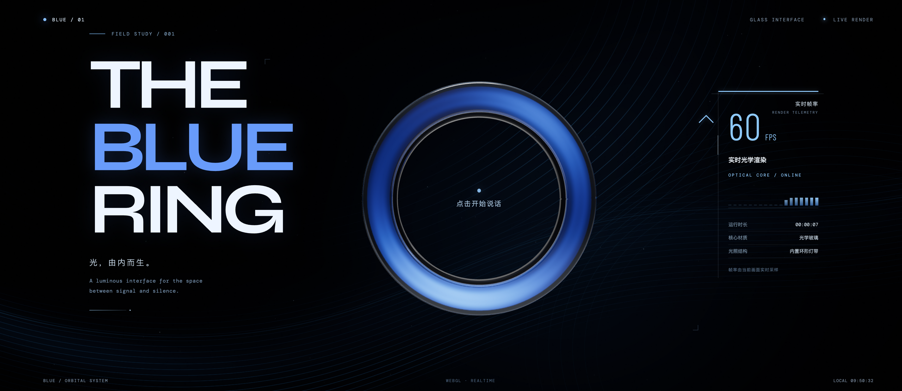
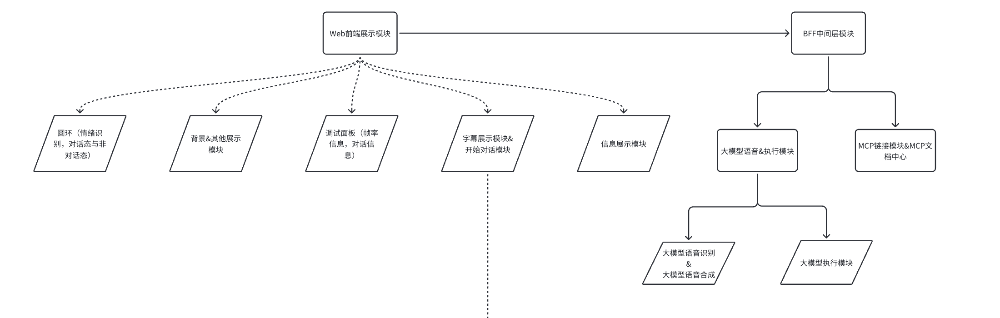

# BLUE / Glass Interface

[简体中文](#中文) · [English](#english)

## 中文

### 快速开始

BLUE 是一个实时语音交互与光环展示系统。启动后，点击页面中央圆环开始语音对话；系统将识别语音、把最终内容交给 Agent 处理，并在界面中展示对话和实时渲染状态。

```bash
npm install
cp .env.example .env   # 按需填写服务密钥
npm run dev
```

打开终端输出的本地地址。日常开发只需要保持 `npm run dev` 运行；此命令会启动 Vite，并同时挂载 Node BFF。只有在准备按生产方式验证或部署时，才需要先构建再启动：

```bash
npm run build
npm start
```

需要 Node.js `>=22.14`。语音识别需要配置 `DOUBAO_API_KEY`；Agent 模型调用需要配置 `ASXS_CODE_API_KEY`。不配置语音密钥时，仍可启动和查看界面；完整对话需要相应服务可用。首次使用麦克风需在浏览器授权，非本机部署需使用 HTTPS。



### 架构设计

系统由浏览器展示层和同源 Node BFF 组成。浏览器负责 Three.js 场景、麦克风采集、语音活动检测、字幕与音频播放；BFF 代理 ASR/TTS 请求，并承载 Agent 与 MCP 调用。模型密钥保留在服务端环境变量中。



一次语音交互的主要路径是：浏览器采音并通过 BFF 请求 ASR，最终识别文本提交给 `/api/agent/run`；Agent 通过单一 MCP 网关发现并调用工具，结果返回界面字幕，并可由 TTS 播报。圆环和 HUD 展示实时渲染状态及对话反馈。MCP 未配置远端服务时使用本地 Demo Registry。

| 模块 | 职责 |
| --- | --- |
| Web 前端 | Three.js 场景、圆环状态、HUD、麦克风、字幕及音频播放 |
| Node BFF | 静态文件服务、ASR/TTS 服务端连接、Agent API 与密钥边界 |
| Agent | 调用 OpenAI-compatible 模型，并通过 MCP 网关执行工具 |
| MCP | 注册与分发 Tools/Resources；支持本地 Demo 或远端 HTTP 服务 |

进一步配置见 [语音识别](docs/voice-asr.md)、[语音合成](docs/voice-tts.md)、[Agent + MCP](docs/agent-mcp.md) 和 [GitHub Actions 语法教程](docs/github-actions-guide.md)。

## English

### Quick Start

BLUE is a real-time voice interaction system with a live glass-ring display. Start the app and click the center ring to begin a voice session. The system transcribes speech, sends the final input to the Agent, and displays the conversation alongside live rendering metrics.

```bash
npm install
cp .env.example .env   # add service credentials as needed
npm run dev
```

Open the local URL printed in the terminal. For day-to-day development, keep `npm run dev` running; it starts Vite and mounts the Node BFF in the same process. Only build and start separately when verifying or deploying the production server:

```bash
npm run build
npm start
```

Requires Node.js `>=22.14`. Set `DOUBAO_API_KEY` for speech recognition and `ASXS_CODE_API_KEY` for model-backed Agent requests. The interface can run without speech credentials, but a complete conversation requires the relevant services. Grant microphone access in the browser; use HTTPS when accessing the app remotely.


### Architecture

The system has a browser presentation layer and a same-origin Node BFF. The browser renders the Three.js scene, captures microphone audio, detects voice activity, and handles captions and audio playback. The BFF connects to ASR/TTS providers and hosts the Agent and MCP integration. Model credentials stay in server-side environment variables.


The main voice flow is: the browser captures audio and requests ASR through the BFF; the final transcript is sent to `/api/agent/run`; the Agent discovers and calls tools through one MCP gateway; results return to the captions and can be spoken by TTS. The ring and HUD show live rendering state and interaction feedback. A local Demo Registry is used when no remote MCP service is configured.

| Module | Responsibility |
| --- | --- |
| Web frontend | Three.js scene, ring state, HUD, microphone, captions, and audio playback |
| Node BFF | Static files, server-side ASR/TTS connections, Agent API, and credential boundary |
| Agent | Calls an OpenAI-compatible model and executes tools through the MCP gateway |
| MCP | Registers and dispatches Tools/Resources through a local demo or remote HTTP service |

For service configuration, see [speech recognition](docs/voice-asr.md), [speech synthesis](docs/voice-tts.md), [Agent + MCP](docs/agent-mcp.md), and the [GitHub Actions syntax guide](docs/github-actions-guide.md).
